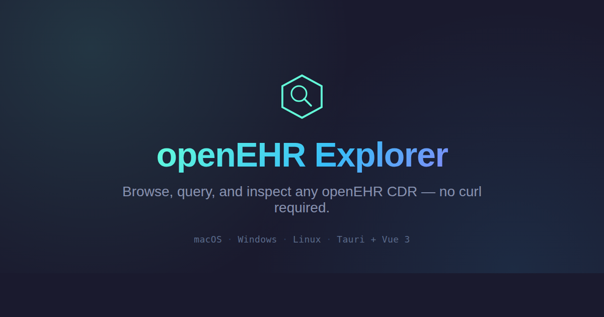
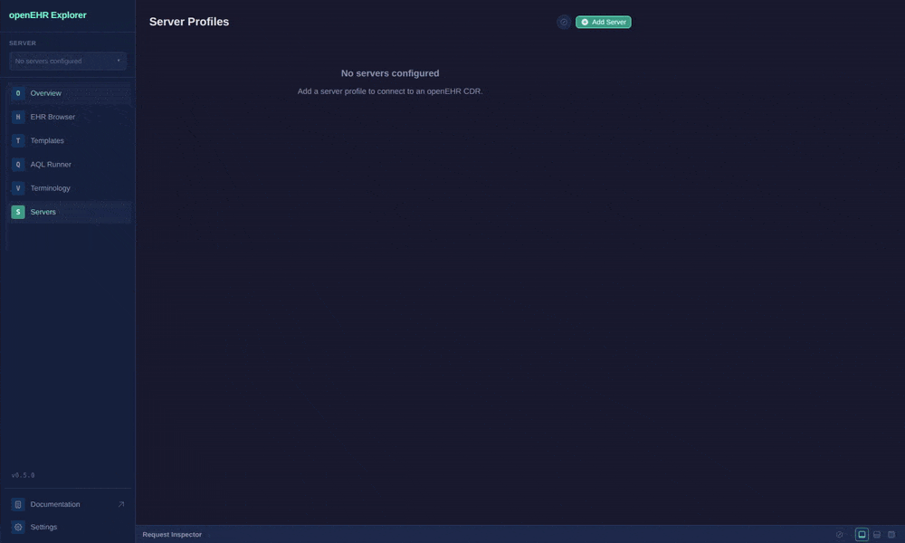
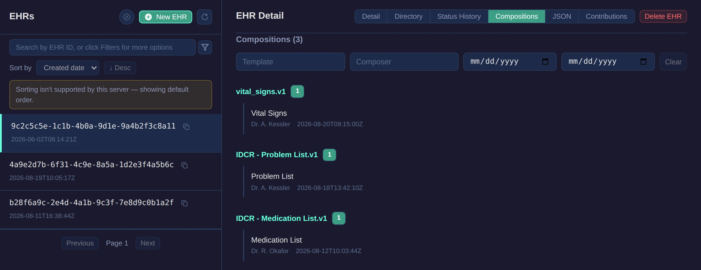
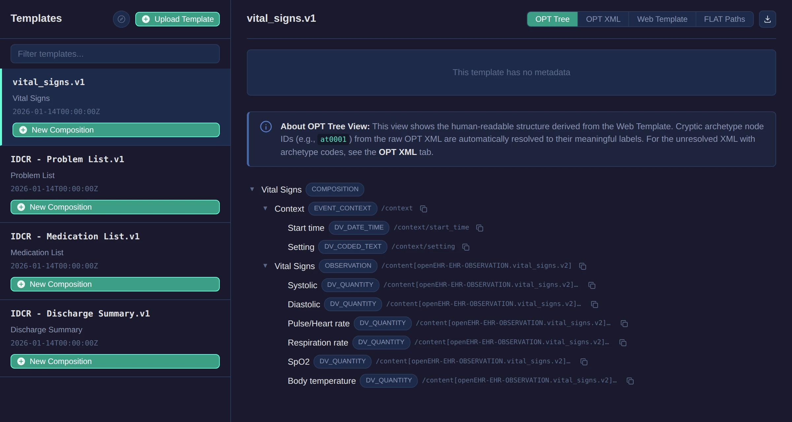
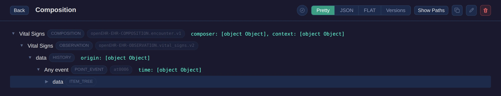
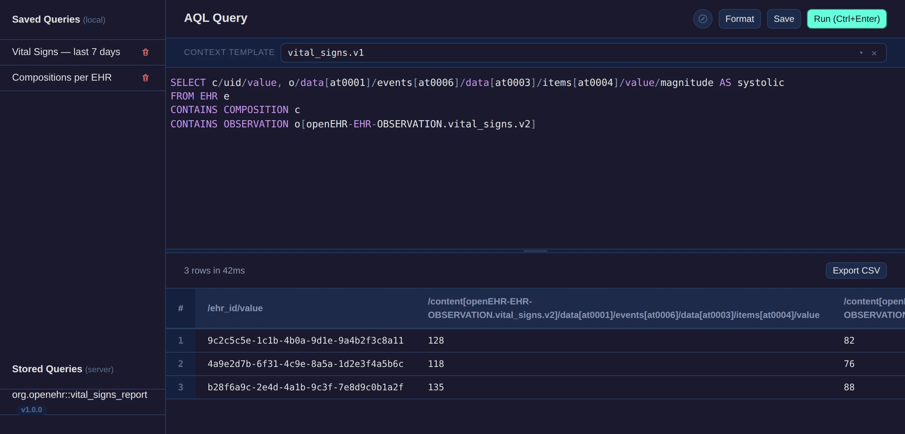

<p align="center">
  
</p>

<p align="center">
  <a href="https://github.com/platzhersh/openehr-explorer/releases/latest"></a>
  <a href="https://github.com/platzhersh/openehr-explorer/releases/latest"></a>
  <a href="LICENSE"></a>
  <a href="https://github.com/platzhersh/openehr-explorer/actions/workflows/ci.yml"></a>
  <a href="https://platzhersh.github.io/openehr-explorer/"></a>
</p>

A cross-platform desktop application for browsing, querying, and inspecting openEHR CDR instances (EHRBase, Better Platform, etc.).

Built with [Tauri](https://tauri.app) (Rust) + Vue 3 + TypeScript.

## Features

- **Server Connection Manager** — Save and switch between multiple CDR instances with auto version detection
- **EHR Browser** — Paginated list with server-side AQL search (subject, namespace, system, modifiable, hasCompositions)
- **Composition Viewer** — Template-aware "pretty" view with human-readable labels, raw JSON, and FLAT format
- **FLAT Path Panel** — One-click copy of FLAT paths for SDK development
- **Template Browser** — Inspect Web Template trees, view OPT XML, drag-and-drop upload
- **AQL Query Runner** — Execute AQL queries with 3-layer autocomplete, tabular results, saved queries, CSV export
- **Request Inspector** — View all HTTP traffic with request/response details, copy as curl
- **Keyboard Shortcuts** — Navigate with Cmd+1-4, toggle inspector with Cmd+Shift+I, execute queries with Cmd+Enter

## Screenshots

<p align="center">
  
</p>

<table>
  <tr>
    <td></td>
    <td></td>
  </tr>
  <tr>
    <td></td>
    <td></td>
  </tr>
</table>

## Installation

Download the latest build for macOS, Windows, or Linux from [GitHub Releases](https://github.com/platzhersh/openehr-explorer/releases/latest).

**macOS** — also installable via Homebrew:

```bash
brew install --cask platzhersh/openehr-explorer/openehr-explorer
```

**Windows** — also installable via Scoop:

```bash
scoop bucket add openehr-explorer https://github.com/platzhersh/scoop-openehr-explorer
scoop install openehr-explorer
```

**Linux** — `.deb` (Debian/Ubuntu) or portable `.AppImage` (any distro):

```bash
# .deb
sudo apt install ./openehr-explorer_<version>_amd64.deb

# or .AppImage
chmod +x openehr-explorer_<version>_amd64.AppImage && ./openehr-explorer_<version>_amd64.AppImage
```

See the [installation docs](https://platzhersh.github.io/openehr-explorer/docs.html#installation) for troubleshooting (unsigned builds, Gatekeeper/SmartScreen warnings).

## Prerequisites

Only needed if you're building from source:

- [Rust](https://rustup.rs/) (stable)
- [Node.js](https://nodejs.org/) (v18+)
- Platform-specific dependencies for Tauri: see [Tauri Prerequisites](https://tauri.app/start/prerequisites/)

## Development

```bash
npm install
npm run tauri dev
```

## Build

```bash
npm run tauri build
```

## Tool Comparison

> **The Postman for openEHR** — but template-aware.

There is no dedicated developer GUI for openEHR. Developers currently reach for generic tools (Postman, curl) or heavyweight alternatives (openEHRTool v2 with Docker, Better Studio for Better Platform only, ehr-ctrl). openEHR Explorer fills that gap.

See the full, always-up-to-date **[Tool Comparison](https://platzhersh.github.io/openehr-explorer/compare.html)** on the docs site for a feature-by-feature breakdown against openEHRTool v2, Postman/curl, Better Studio, and ehr-ctrl.

## Documentation

- [User docs & guides](https://platzhersh.github.io/openehr-explorer/docs.html)
- [Tool comparison](https://platzhersh.github.io/openehr-explorer/compare.html)
- [PRDs](docs/prd/) — product requirements for each feature
- [ADRs](docs/adr/) — architecture decisions and rationale
- [RELEASING.md](RELEASING.md) — release process

## License

Apache 2.0 — see [LICENSE](LICENSE) for details.
