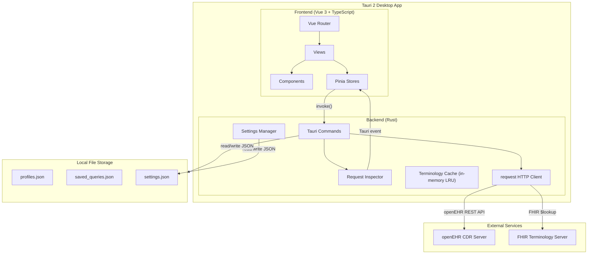
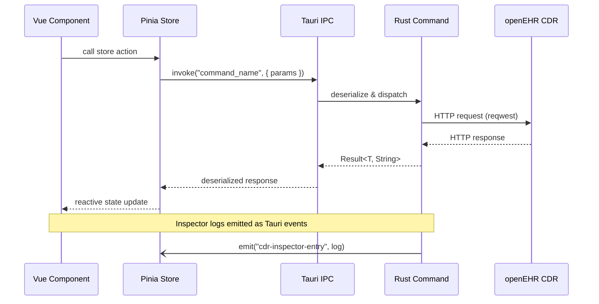
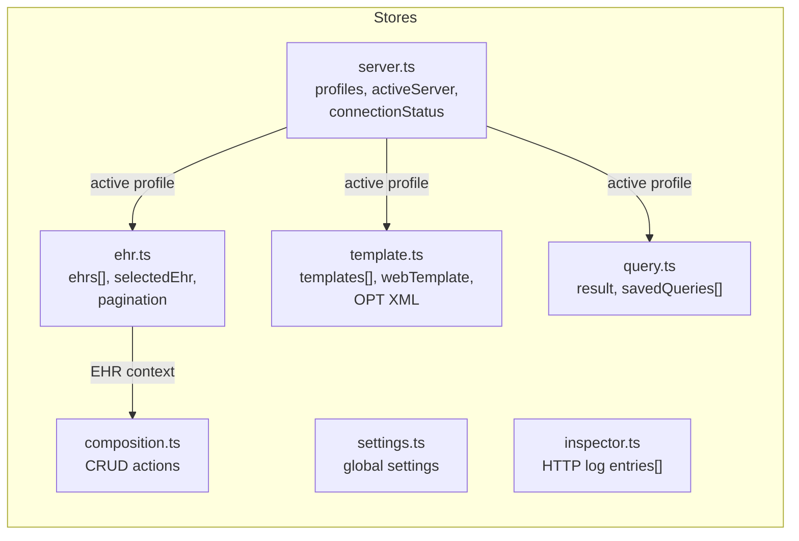
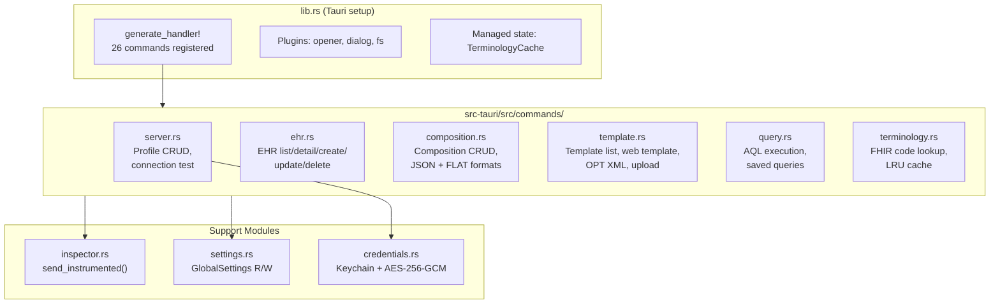
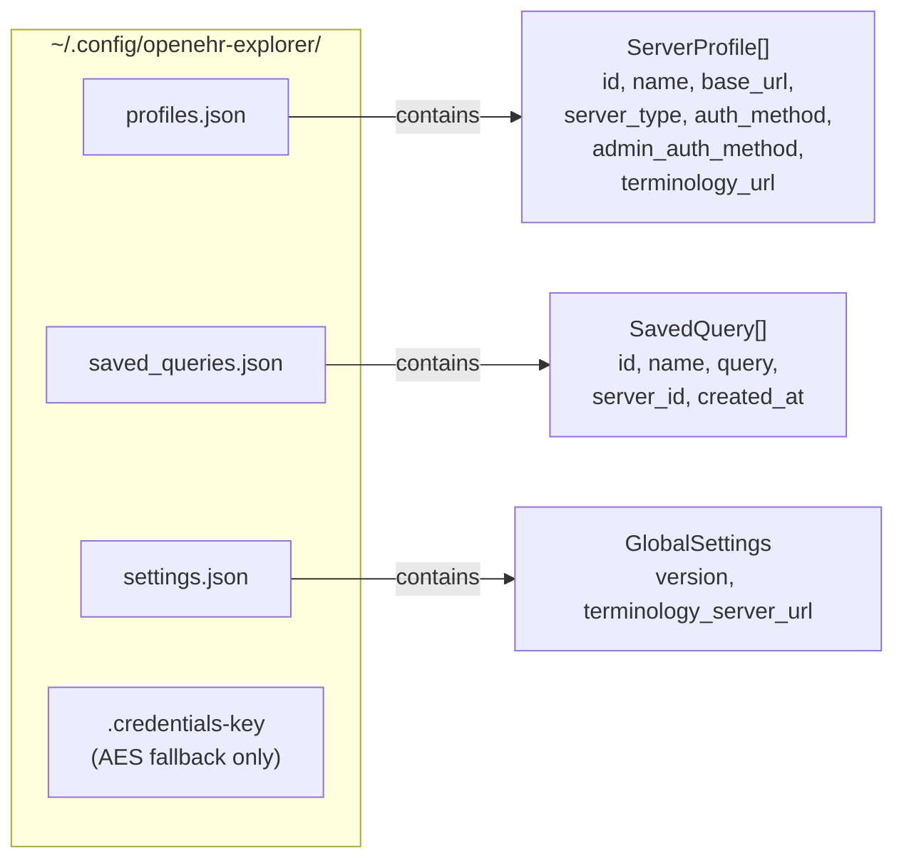
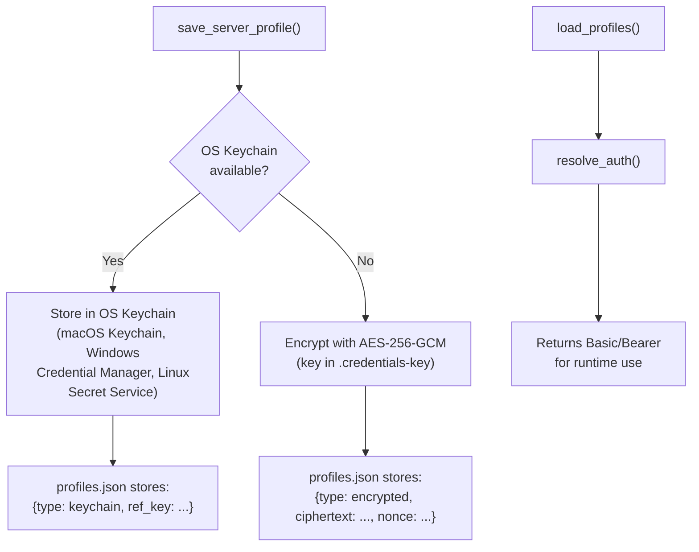
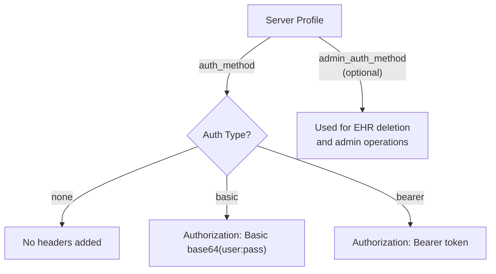

# Architecture Overview

This document describes the high-level architecture of openEHR Explorer, a cross-platform desktop application for browsing, querying, and inspecting openEHR CDR instances.

## Technology Stack

```
┌──────────────────────────────────────────────────────────┐
│                    Desktop Window (Tauri 2)               │
│  ┌────────────────────────────────────────────────────┐  │
│  │              Frontend (WebView)                     │  │
│  │         Vue 3 + TypeScript + Pinia                  │  │
│  │         CodeMirror (AQL editor)                     │  │
│  │         medblocks-ui (form rendering)               │  │
│  └───────────────────┬────────────────────────────────┘  │
│                      │ Tauri IPC (invoke / events)        │
│  ┌───────────────────▼────────────────────────────────┐  │
│  │              Backend (Rust)                          │  │
│  │         Tauri commands + reqwest HTTP client         │  │
│  │         serde JSON serialization                    │  │
│  │         quick-xml OPT parsing                       │  │
│  └───────────────────┬────────────────────────────────┘  │
└──────────────────────┼───────────────────────────────────┘
                       │
          ┌────────────┴────────────┐
          │                         │
          ▼                         ▼
   Local JSON Files          openEHR CDR Servers
   (~/.config/...)           (EHRBase, Better, ...)
```

## System Architecture



## Frontend-Backend Communication

The app uses **Tauri's invoke pattern** — a typed IPC bridge between the Vue frontend and Rust backend. All backend calls are async.



**Frontend call pattern (TypeScript):**
```typescript
import { invoke } from "@tauri-apps/api/core";
const result = await invoke<ReturnType>("command_name", { param: value });
```

**Backend command pattern (Rust):**
```rust
#[tauri::command]
pub async fn command_name(param: Type) -> Result<ReturnType, String> { ... }
```

## Frontend Architecture

### Views & Routes

| Route | View | Purpose |
|-------|------|---------|
| `/ehrs` | `EhrBrowser` | Paginated EHR list, detail panel, composition grouping |
| `/ehrs/:ehrId/compositions/:uid` | `CompositionViewer` | Pretty/JSON/FLAT tabs, path panel, search |
| `/templates` | `TemplateBrowser` | Template list, web template tree, OPT XML, term bindings |
| `/aql` | `AqlRunner` | AQL editor (CodeMirror), saved queries, tabular results |
| `/servers` | `ServerManager` | Server profile CRUD, connection testing |
| `/settings` | `Settings` | Global settings (terminology server URL) |
| `/compose/:templateId` | `CompositionForm` | Create/edit compositions (medblocks-ui forms) |

### Pinia Stores



### Key Components

| Component | Purpose |
|-----------|---------|
| `AppSidebar` | Navigation sidebar with version display |
| `ServerSwitcher` | Server profile dropdown + connection status |
| `RequestInspector` | HTTP traffic viewer, filters, curl export |
| `AqlEditor` | CodeMirror-based AQL editor with path completions |
| `CompositionTree` | Interactive tree view of composition data |
| `EhrCreateDialog` | EHR creation form with subject identity fields |
| `OptMetadata` | OPT XML metadata and term bindings display |
| `SearchOverlay` | In-page search (Ctrl+F) with match highlighting |

## Rust Backend Architecture

### Command Modules



### HTTP Request Flow

Every outgoing HTTP request goes through `send_instrumented()` in `inspector.rs`, which:

1. Records the request (method, URL, headers, body)
2. Sends the request via `reqwest`
3. Records the response (status, headers, body, duration)
4. Emits a `cdr-inspector-entry` Tauri event to the frontend
5. Redacts sensitive headers (Authorization, Cookie, etc.)

## Local Data Persistence

The app uses **JSON file storage** — no database engine (SQLite or otherwise). All local data is stored as JSON files in the platform config directory.

### Storage Location

```
~/.config/openehr-explorer/          # Linux (XDG_CONFIG_HOME)
~/Library/Application Support/openehr-explorer/  # macOS
C:\Users\<user>\AppData\Roaming\openehr-explorer\  # Windows
```

### Stored Files



### Credential Storage (ADR-0014)

Server credentials (passwords, bearer tokens) are **never stored in plaintext** on disk. The app uses a two-tier approach:



| Platform | Keychain Backend | Fallback needed? |
|----------|-----------------|------------------|
| macOS | Keychain Services | No |
| Windows | Credential Manager | No |
| Linux (desktop) | Secret Service (GNOME Keyring / KDE Wallet) | Rarely |
| Linux (headless) | N/A | Yes (AES-256-GCM) |

**Migration:** On first load after upgrade, any plaintext `Basic`/`Bearer` credentials in `profiles.json` are automatically migrated to secure storage. The migration is one-way and transparent.

**Implementation:** `src-tauri/src/credentials.rs` (keychain + AES helpers), `src-tauri/src/commands/server.rs` (`secure_auth()` / `resolve_auth()`)

### Why JSON Files (not SQLite)

The app stores a small number of simple records (server profiles, saved queries, settings). JSON files provide:

- **Zero dependencies** — no native SQLite library needed
- **Human-readable** — users can inspect/edit config files directly (credentials are encrypted)
- **Portable** — no database migration concerns
- **Sufficient** — the data volume is small (tens of records, not thousands)

### Persistence Pattern

All JSON file I/O follows the same pattern in Rust:

```rust
// Read: load file → deserialize → resolve credentials → return Vec<T>
fn load_items() -> Vec<T> {
    let path = get_items_path();           // ~/.config/openehr-explorer/items.json
    let data = fs::read_to_string(&path).unwrap_or_default();
    serde_json::from_str(&data).unwrap_or_default()
}

// Write: secure credentials → serialize → write file
fn save_items(items: &[T]) -> Result<(), String> {
    let path = get_items_path();
    let data = serde_json::to_string_pretty(&store).map_err(|e| e.to_string())?;
    fs::write(&path, data).map_err(|e| e.to_string())
}
```

### Draft Persistence (Frontend)

Composition drafts use **localStorage** (browser storage within the WebView) with 24-hour expiry and auto-save every 30 seconds. This is separate from the Rust-managed JSON files.

## Authentication Architecture



Credentials are stored securely using the OS keychain or AES-256-GCM encryption (see [Credential Storage](#credential-storage-adr-0014) above). Each profile supports:
- **Regular auth** — used for all standard API calls
- **Admin auth** (optional) — used for destructive operations (EHR deletion)

## Configuration Hierarchy

```
Global Settings (settings.json)
    └── terminology_server_url: "https://tx.fhir.ch/r4"

Server Profile Override (profiles.json)
    └── terminology_url: "https://custom-server/fhir"  (optional)

Effective Value = profile override ?? global setting
```

## External Integrations

### openEHR CDR Servers

The app communicates with openEHR Clinical Data Repositories via the [openEHR REST API](https://specifications.openehr.org/releases/ITS-REST/latest/). Server type (`ehrbase`, `better_platform`, `generic`) determines URL path conventions.

**Supported operations:** EHR CRUD, Composition CRUD (JSON + FLAT), Template management (Web Template + OPT), AQL query execution.

### FHIR Terminology Server

Used for resolving coded terms (SNOMED-CT, LOINC, ICD-10, ATC) via the FHIR CodeSystem `$lookup` operation. Results are cached in an in-memory LRU cache (`TerminologyCache` managed as Tauri state).

## Directory Structure

```
openehr-explorer/
├── src/                          # Frontend
│   ├── views/                    #   Page components (7 views)
│   ├── components/               #   Reusable components (10)
│   ├── stores/                   #   Pinia state stores (7)
│   ├── composables/              #   Vue composables
│   ├── lib/                      #   Utilities (webtemplate, terminology, AQL)
│   ├── styles/                   #   Global CSS
│   ├── App.vue                   #   Root layout (sidebar + content)
│   └── main.ts                   #   Entry point (app, router, pinia)
├── src-tauri/                    # Backend
│   ├── src/
│   │   ├── commands/             #   Tauri command modules (6)
│   │   ├── inspector.rs          #   HTTP request instrumentation
│   │   ├── settings.rs           #   Global settings manager
│   │   ├── lib.rs                #   Tauri setup & command registration
│   │   └── main.rs               #   Rust entry point
│   ├── Cargo.toml                #   Rust dependencies
│   └── tauri.conf.json           #   Tauri configuration
├── docs/                         # Documentation
│   ├── prd/                      #   Product requirement documents
│   ├── adr/                      #   Architecture decision records
│   └── ARCHITECTURE.md           #   This file
├── public/                       # Static assets
└── package.json                  # Frontend dependencies
```
